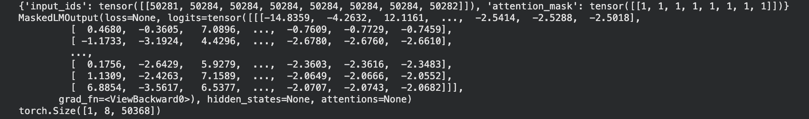
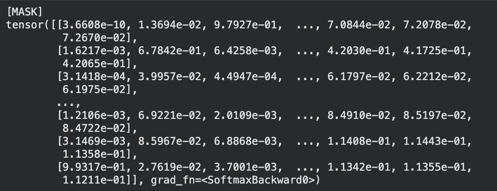

# To get predictions for the mask:
```python
text = "The capital of France is [MASK]."
inputs = tokenizer(text, return_tensors="pt")
outputs = model(**inputs)
masked_index = inputs["input_ids"][0].tolist().index(tokenizer.mask_token_id)
predicted_token_id = outputs.logits[0, masked_index].argmax(axis=-1)
predicted_token = tokenizer.decode(predicted_token_id)
print("Predicted token:", predicted_token)
```

```python
print(tokenizer.decode([50284])) # decodes input_ids into corresponding word
outputs.logits[0][masked_index] # gets the probability distrubution of a row(position)
prob=torch.nn.functional.softmax(outputs.logits[0][masked_index],dim=0) # converts to normalized probability
print(prob)
```



# Step 1: generate data (will take a while — many model forward passes)
python3 analyze_orders.py

# Step 2: start server
pip install fastapi uvicorn
python3 server.py
# then open http://localhost:8000
